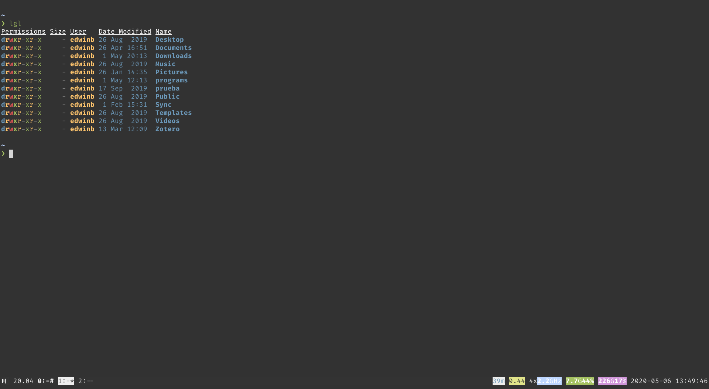

# Axioms

These are the *axioms* or *rules* for my own development setup.

## Rationale

**Axioms** are postulates that are taken to be true in order to build a mathematical
system. With them, one can build more complex statements. In the same spirit,
[*the humble programmer*](https://www.cs.utexas.edu/~EWD/transcriptions/EWD03xx/EWD340.html)
has the need for the basic building blocks to develop new software, and these should
be always **true**, i.e. robust and reliable.

With this repository, one should be able to have basic building blocks that could enable
the eager developer to produce quality software of any kind.

## Structure

Everything is orchestrated through a [TOML](https://github.com/toml-lang/toml) file
`master-config.toml` where everything I use can be browsed freely, as well as a
Python parser that takes care of installing and updating everything.

All the configuration files are freely available to use under the stipulated license
packaged with this repository.

## Usage

### Python version and environment

`python 3.8` is **compulsory** as the new [walrus operator](https://www.python.org/dev/peps/pep-0572/) is employed.

### Handling dependencies and `poetry`

To be able to use this repository, [`poetry`](https://poetry.eustace.io/)
must be installed in your system. Once that is done, you can clone
this repository like such

    git clone --depth 1 https://github.com/edwinb-ai/axioms.git

in the directory of your choice.

After cloning, the dependencies need to be installed using `poetry`

    poetry install

and then you can install all of the configurations using

    poetry run invoke git terminal editor shell programs languages

or, if you prefer a specific configuration, just call that, for example,
if just the editor is needed then the following command is enough

    poetry run invoke editor

and the same applies for the rest.

## Target platform

For now, this only works for most of the Ubuntu-based distributions with Pop!_OS being the primary one,
as it is assumed that the `apt` package manager is the default one. Maybe, in the future, could
more package managers be supported.

## End result

This is what you get with these configuration files:

